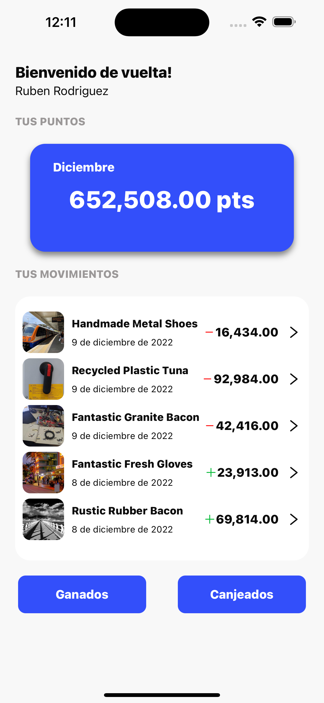
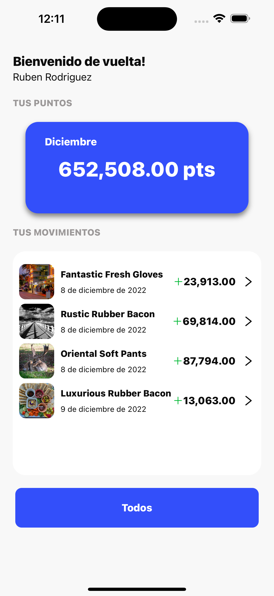
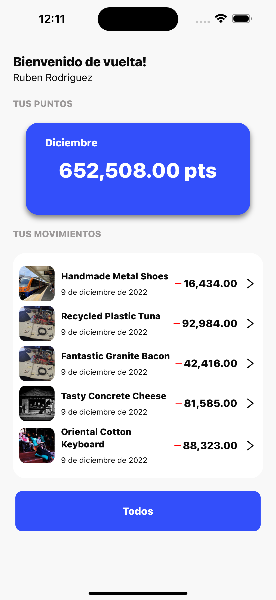
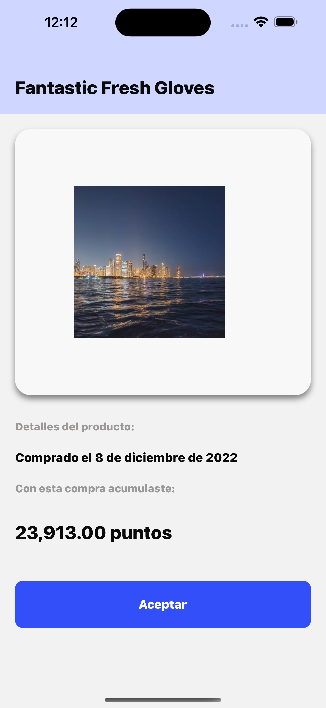
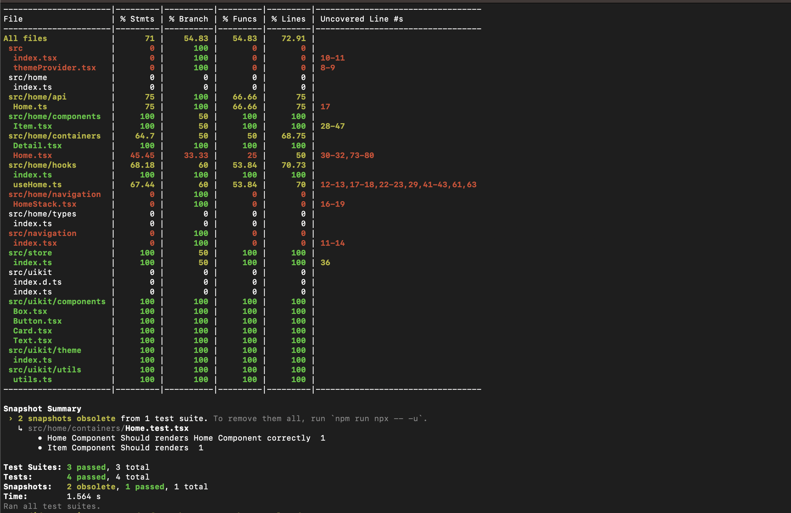

# Challenge
## _Code challenge digital house_

General guidelines
Este code challenge deberá de ser programado en React-Native podrá ser resuelto con JS o TS ya sea con React-native CLI o Expo

Para realizar el desafio opte por utilizar el CLI de React Native, ademas me apoye en librerias como :
- ```@shopify/restyle```: esta libreria la tulice para ayudarme en la creacion de los componentes y manejar de una forma mas comoda los elementos de la interfaza 
- ```react-native-vector-icons"```: Con esta libreria implemente los iconos para el desafio. 
- ```react-redux, redux, redux-logger, redux-persist, @reduxjs/toolkit```: Me apoye en redux para manejar el estado de la app, ademas de utilizar redux toolkit para realizar las peticiones a la api. 
- ```@react-navigation:``` Con esta libreria manje la navegacion entre las pantallas
- ```@testing-library/react-native, jest:``` Para realizar las pruebas.

## Funcionalidades

- El usuario podra ver un listado "_Scrollable_" con los ultimos movimientos (puntos ganados o canjeados)
- Podra filtrar entre sus puntos para ver solo los puntos Canjeados o los puntos Ganados
- Ver el detalle de esos puntos al presionar en cualquiera de los elementos de la lista de movimientos
- En la vista de detalle podra ver una imagen grande del producto comprado, ademas de poder volver a la pantalla anterior.

## ToDo

Requerimientos minimos y Desados:

- [x] Conexión al endpoint
- [x] Navegación entre pantallas
- [x] Pruebas unitarias (Alance a crubir un 71% de codigo en pruebas unitarias) 
   >Las pruebas correspondientes a la pantallad de home no esta completa debido a que la libreria que queria utilizar para probar los hooks, '@testing-library/react-hooks', no esta disponible aun para react 18 

Los siguientes elementos son deseables: 
- [x] Filtro
- [ ] Mantener todos los elementos “pixel perfect”
- [ ] Pruebas unitarias de componente o de integración


## Para probar el desafio
1) Clona el repositorio 
    ```sh
        git clone git@github.com:offcarlospetit/digitalFemsa.git
    ```
2) Instala las dependencias:
    ```sh
        npm i
    ```
2) Instala los Pods para iOS:
    ```sh
        npx pod install
    ```
    >_Nota: si en este paso de ta un problema con la version de ruby puedes revisar este [link](https://reactnative.dev/docs/environment-setup) y encontraras mas detalles sobre como resolverlo._
3) Para lanzar el proyecto _iOS_
    ```sh
        npm run ios
    ```
3) Para lanzar el proyecto _Android_
    ```sh
        npm run android
    ```








## Test: 

